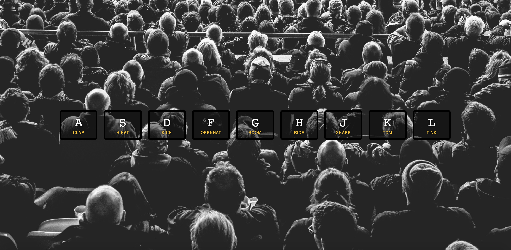

## Day 01 - JavaScript Drum Kit  ✅

### Date 07/08/2020

### Things have been learned:
- HTML tag `<kbd>` - is used to define keyboard input;
-  `data attribute` - . data-* attributes allow us to store extra information on standard (_MDN_);
- accessing `data attribute` with JS (_MDN_):
    - `getAttribute()`;
    - `dataset` property;

- accessing `data attribute` with CSS (_MDN_):
    - `attr()` function;
    - `attribute selectors`;

To challenge myself, I have added the same functionality to the click on button event and separated the handlers and event listeners.
