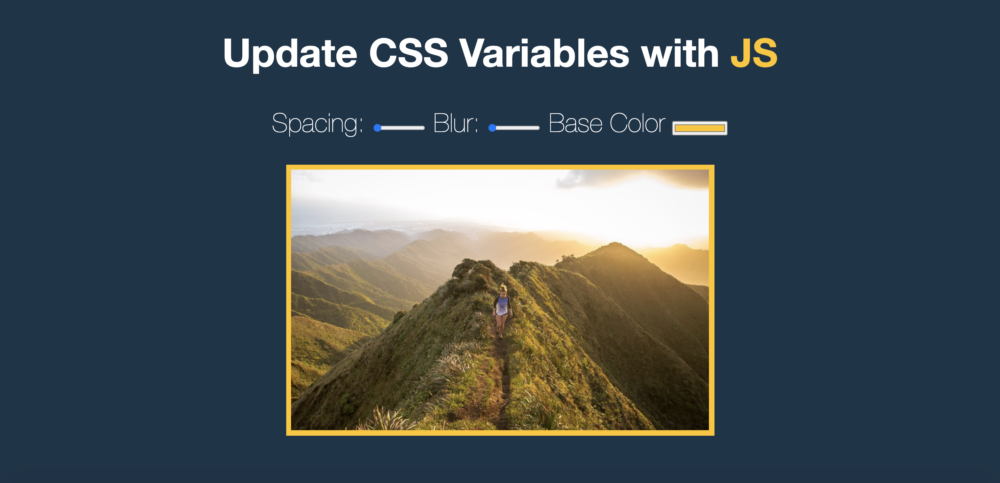

## Day 03 - JavaScript CSS Variables  ✅

### Date 10/08/2020

### Things have been learned:
- `Document.documentElement `returns the Element that is the root element of the document

-  The `setProperty()` method sets a new or modifies an existing CSS property in a CSS declaration block.

    #### Syntax `object.setProperty(propertyname, value, priority)`;

