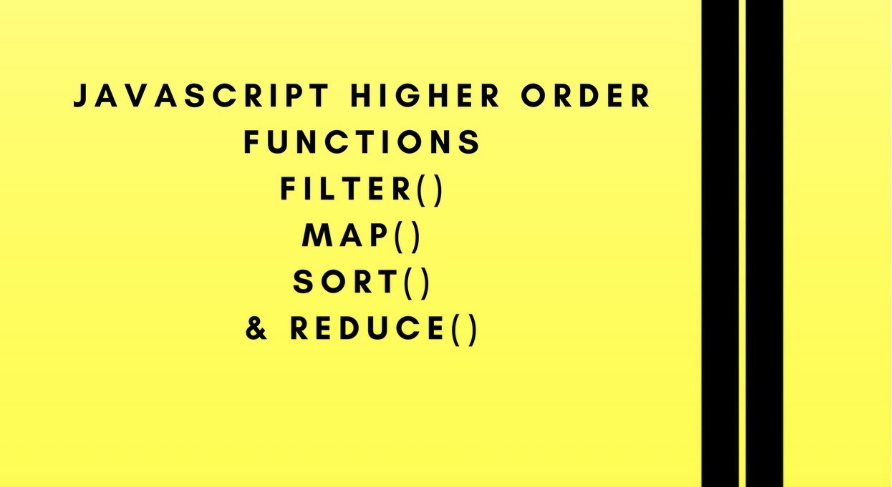

## Day 03 - JavaScript Array Cardio Day 01  ✅

### Date 10/08/2020



### Things have been learned:
- The `filter()` method creates a new array with all elements that pass the test implemented by the provided function.

Syntax
```js
let newArray = arr.filter(callback(element[, index, [array]])[, thisArg]);
```

-  The `map()` method creates a new array populated with the results of calling a provided function on every element in the calling array.

Syntax
```js
    let new_array = arr.map(function callback( currentValue[, index[, array]]) {
    // return element for new_array
}[, thisArg]);
```

-  The `sort()` method sorts the elements of an array in place and returns the sorted array. 

Syntax
```js
    arr.sort([compareFunction]);
```
-  The `reduce()` method executes a reducer function (that you provide) on each element of the array, resulting in single output value.

Syntax
```js
    arr.reduce(callback( accumulator, currentValue[, index[, array]] )[, initialValue]);
```


