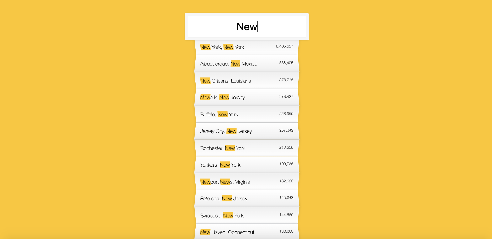

## Day 03 - JavaScript Type Ahead  ✅

### Date 11/08/2020



### Things have been learned:
- `Fetch` provides a generic definition of `Request` and `Response` objects (and other things involved with network requests).

The `fetch()` method takes one mandatory argument, the path to the resource you want to fetch. It returns a Promise that resolves to the Response to that request, whether it is successful or not.

-  A `promise` is an object that may produce a single value some time in the future: either a resolved value, or a reason that it’s not resolved (e.g., a network error occurred). A promise may be in one of 3 possible states: fulfilled, rejected, or pending

- The `then()` method returns a Promise. It takes up to two arguments: callback functions for the success and failure cases of the Promise.

Syntax
```js
    p.then(onFulfilled[, onRejected]);

    p.then(value => {
    // fulfillment
    }, reason => {
    // rejection
});
```


