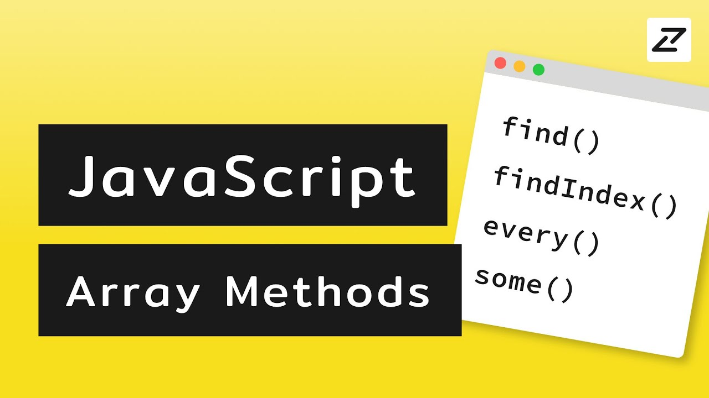

## Day 03 - JavaScript Array Cardio Day 02  ✅

### Date 11/08/2020



### Things have been learned:
- The `some()` method tests whether at least one element in the array passes the test implemented by the provided function. It returns a Boolean value.

Syntax
```js
arr.some(callback(element[, index[, array]])[, thisArg])
```

-  The `every()` method tests whether all elements in the array pass the test implemented by the provided function. It returns a Boolean value.

Syntax
```js
  arr.every(callback(element[, index[, array]])[, thisArg])
```

-  The `find()` method returns the value of the first element in the provided array that satisfies the provided testing function. 

Syntax
```js
    arr.find(callback(element[, index[, array]])[, thisArg])
```

-  The `findIndex()` method returns the index of the first element in the array that satisfies the provided testing function. Otherwise, it returns -1, indicating that no element passed the test.

Syntax
```js
    arr.findIndex(callback( element[, index[, array]] )[, thisArg])
```


