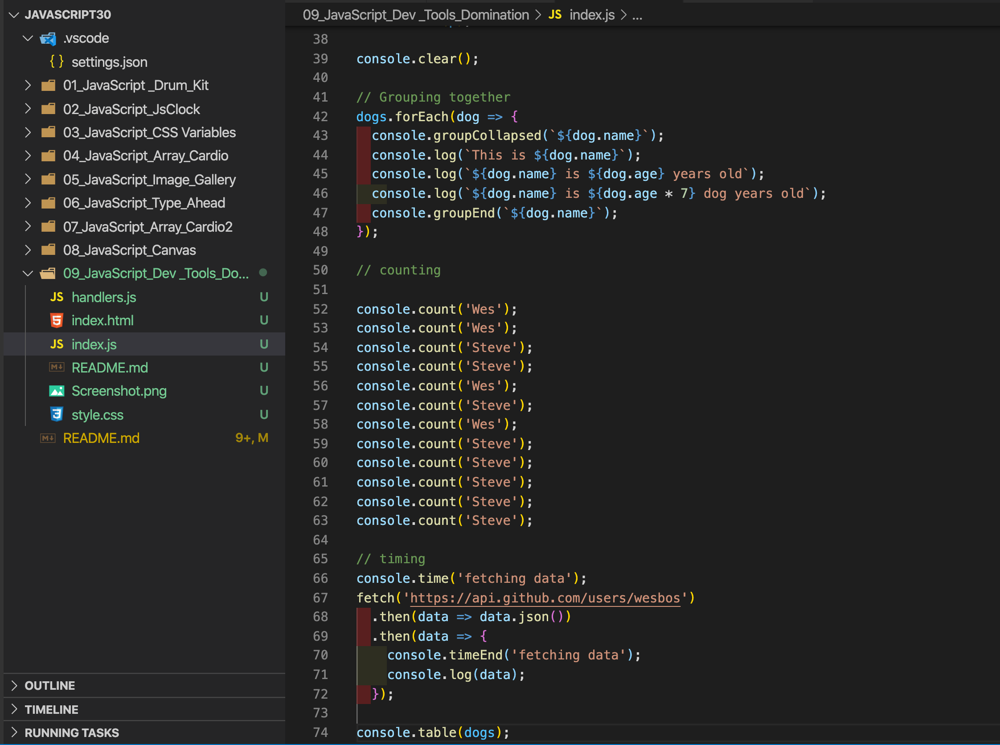

## Day 04 - JavaScript Dev Tools Domination  ✅

### Date 12/08/2020

### Things have been learned:

- The `console.assert()` method writes an error message to the console if the assertion is false. If the assertion is true, nothing happens.

- The `Console method dir()` displays an interactive list of the properties of the specified JavaScript object. The output is presented as a hierarchical listing with disclosure triangles that let you see the contents of child objects.

- `Console.group()` - creates a new inline group in the Web Console log. This indents following console messages by an additional level, until console.groupEnd() is called.
