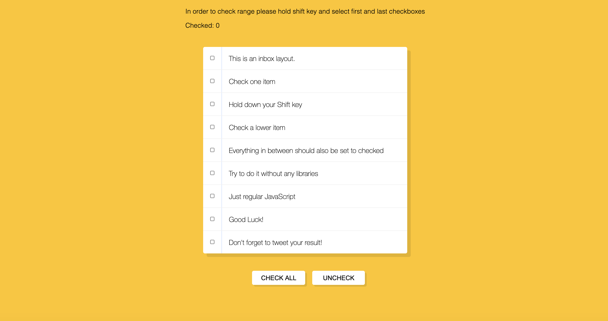

## Day 05 - JavaScript Dev Tools Domination  ✅

### Date 13/08/2020

### Things have been learned:

- The `KeyboardEvent.shiftKey` read-only property is a Boolean that indicates if the shift key was pressed (true) or not (false) when the event occurred.

- The JavaScript `this` keyword refers to the object it belongs to.
It has different values depending on where it is used:

    In a method, this refers to the owner object.
    Alone, this refers to the global object.
    In a function, this refers to the global object.
    In a function, in strict mode, this is undefined.
    In an event, this refers to the element that received the event.
    Methods like call(), and apply() can refer this to any object.

- The `checked property` sets or returns the checked state of a checkbox.

    This property reflects the HTML checked attribute.

To challenge myself I added two buttons  with `checkall` and `uncheck` all, as well as a function to count and display the number of checked boxes.
