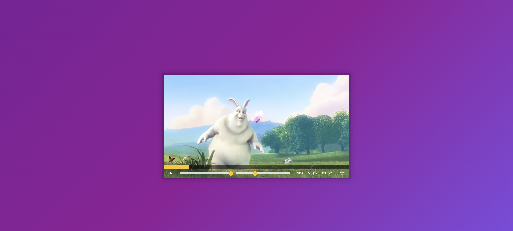

## Day 05 - JavaScript Custom Video Player ✅

### Date 13/08/2020

### Things have been learned:

- The `currentTime property` sets or returns the current position (in seconds) of the audio/video playback.

    When setting this property, the playback will jump to the specified position.

- The `duration` property returns the length of the current audio/video, in seconds.

- The `flex-basis` CSS property sets the initial main size of a flex item. It sets the size of the content box unless otherwise set with box-sizing.

- The HTMLElement.`offsetWidth` read-only property returns the layout width of an element as an integer.

    Typically, offsetWidth is a measurement in pixels of the element's CSS width, including any borders, padding, and vertical scrollbars (if rendered). It does not include the width of pseudo-elements such as ::before or ::after.

To challenge myself I have added function to display video time, possibility to play and pause video with pressing the space bar, and open or close the full screen video mode. 
