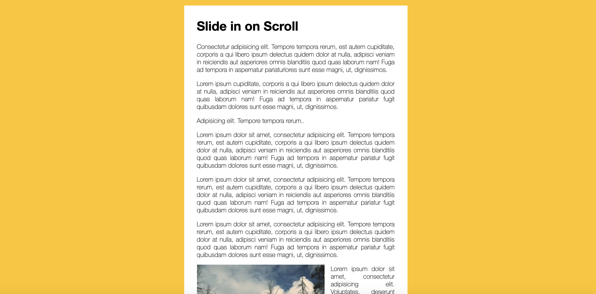

## Day 06 - JavaScript Slide in on Scroll ✅

### Date 14/08/2020



### Things have been learned:

- The `debounce()` function forces a function to wait a certain amount of time before running again. The function is built to limit the number of times a function is called.

    Events such as scrolling, mouse movement, and keypress bring great overhead with them if they are captured every single time they fire. The function aims to reduce overhead by preventing a function from being called several times in succession.

    The following implementation of debounce returns a function that, as long as it continues to be invoked, will not be triggered. The function will be called after it stops being called for N milliseconds. If immediate is passed as an argument to the function, the function triggers immediately and then waits for the interval before being called again.

```js
  function debounce(func, wait, immediate) {
    var timeout;

    return function executedFunction() {
      var context = this;
      var args = arguments;
        
      var later = function() {
        timeout = null;
        if (!immediate) func.apply(context, args);
      };

      var callNow = immediate && !timeout;
    
      clearTimeout(timeout);

      timeout = setTimeout(later, wait);
    
      if (callNow) func.apply(context, args);
    };
  };

```

- The read-only `scrollY` property of the Window interface returns the number of pixels that the document is currently scrolled vertically.

- The read-only `innerHeight` property of the Window interface returns the interior height of the window in pixels, including the height of the horizontal scroll bar, if present.

- The HTMLElement.`offsetWidth` read-only property returns the layout width of an element as an integer.

- The `height` property of the `HTMLImageElement` interface indicates the height at which the image is drawn, in CSS pixels if the image is being drawn or rendered to any visual medium such as the screen or a printer; otherwise, it's the natural, pixel density corrected height of the image.

Syntax 

```js
let height = htmlImageElement.height;
```

- The `HTMLElement.offsetTop` read-only property returns the distance of the current element relative to the top of the offsetParent node.

Syntax 

```js
let topPos = element.offsetTop;
```

