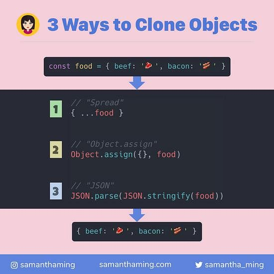

## Day 06 - JavaScript References VS Copying ✅

### Date 25/08/2020



### Things have been learned:

- #### How to copy the array
    - The `slice()` method returns a shallow copy of a portion of an array into a new array object
    - The `concat()` method is used to merge two or more arrays. This method does not change the existing arrays, but instead returns a new array.

    - The `spread operator` :
    ```js
      newArr = [...arr];
    ```

- #### How to copy an object 
    - The `Object.assign()` method copies all enumerable own properties from one or more source objects to a target object. It returns the target object.

    - The `spread operator`;
    - The `JSON.stringify()` method converts a JavaScript object or value to a JSON string;
    - The `JSON.parse()` method parses a JSON string, constructing the JavaScript value or object described by the string.


