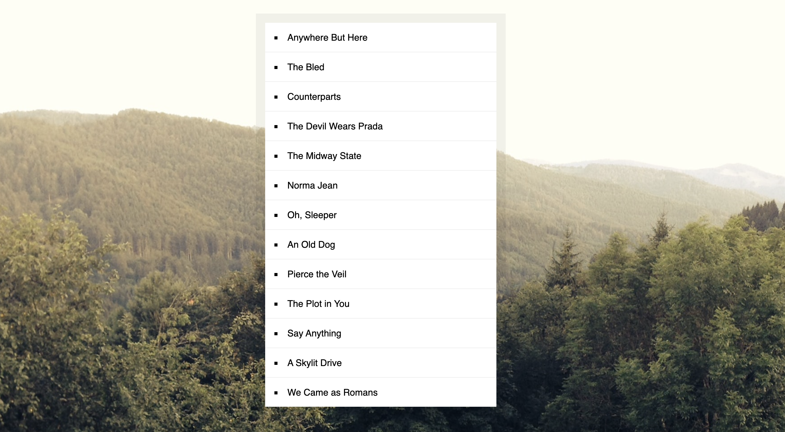

## Day 08 - JavaScript Sort Without Articles ✅

### Date 26/08/2020

### Things have been learned:

- The `trim()` method removes whitespace from both ends of a string.

- The `sort()` method sorts the elements of an array in place and returns the sorted array

